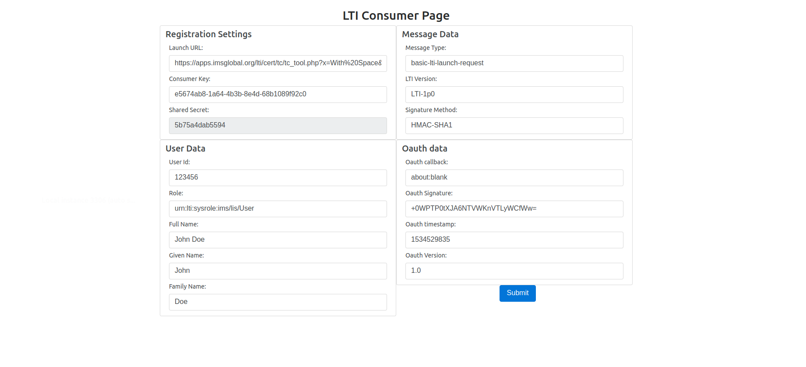

##  LTI CONSUMER TOOL

#### How to run the LTI Consumer Tool

Please follow the below steps to run Consumer

1. Go to `
         LTI-Consumer-Tool/src/main/java/com/sheraz/tutorial/lti/consumer/tool/config/ParamConfig.java
       ` and edit the Parameters as per your requirements. 
       
2. Generate the JAR file 

    ``
    cd LTI-Consumer-Tool/
    ``
    
    ``mvn clean install``
    
3. Run the application 

    ``java -jar target/consumertool-0.0.1-SNAPSHOT.jar``
    
4. Hit the following URL on your browser:

``localhost:8085``

We will see the following page:

